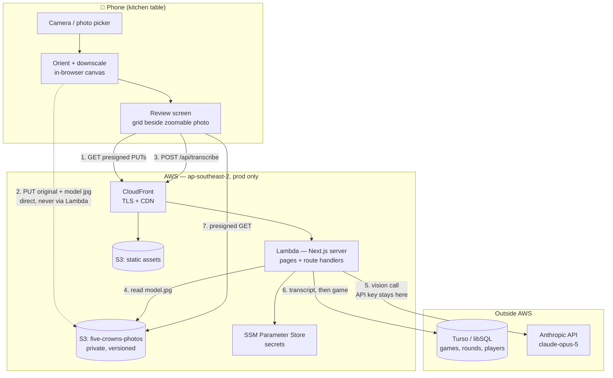
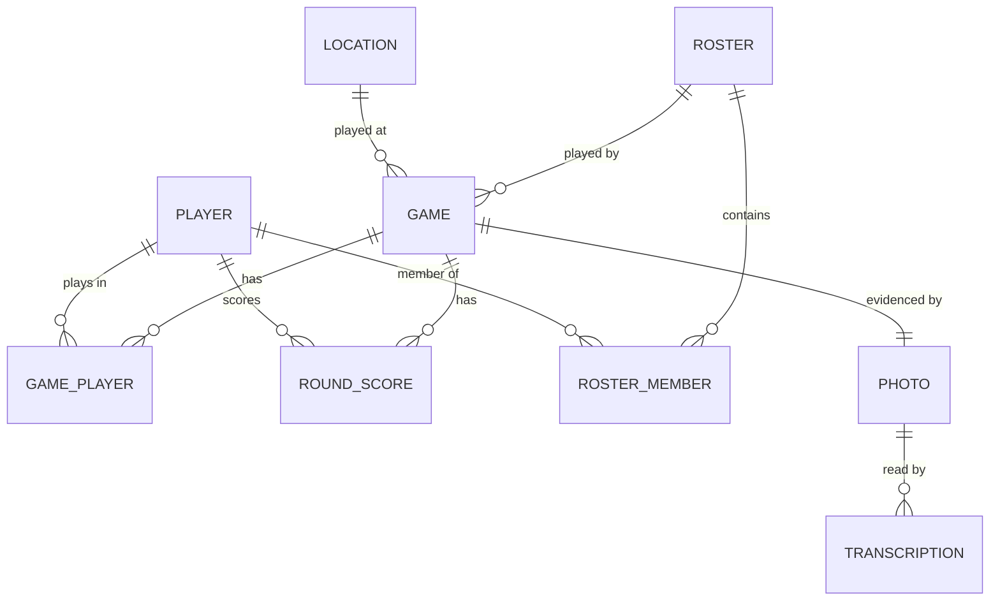
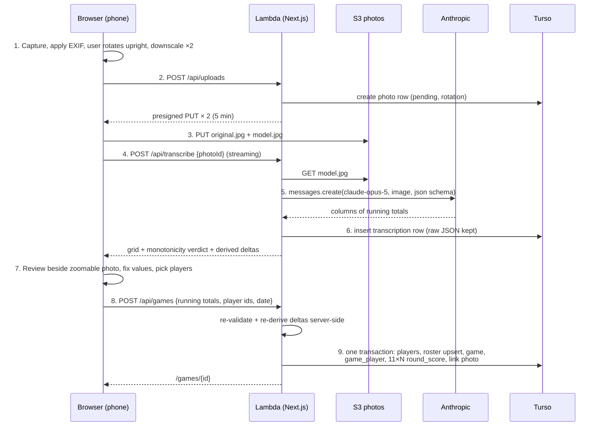
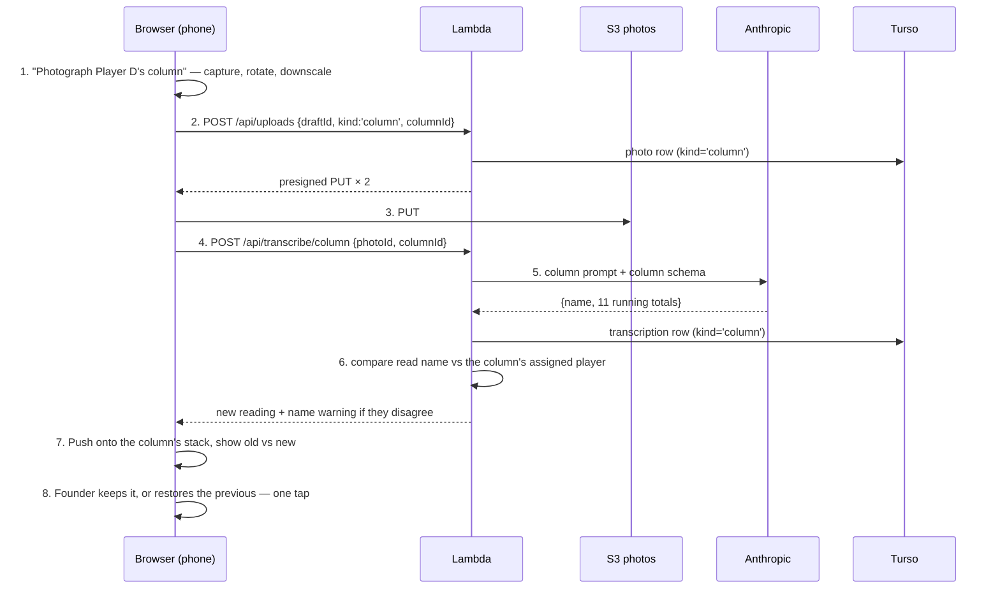

# Architecture — Five Crowns Ledger

*Owned by the architect agent. If code and this doc disagree, fix one of them.*
*Designed 2026-09-10 against `docs/PRD.md`, then revised the same day after two real
scoresheets arrived. Nothing is built yet.*

> ⚠️ **Read this first.** The PRD says the sheet holds eleven round scores plus a total, and that
> "the rounds must sum to the total" is the property the whole product rests on. **The real pad
> does not work that way.** It records **running totals**, and there is no totals row. That
> premise is dead and the validation strategy below replaces it. See
> [ADR 2026-09-10 — The pad records running totals] in `docs/DECISIONS.md`, and
> **`fixtures/sheets/GROUND-TRUTH.md`** — two real sheets transcribed and verified by the founder
> against the paper. That file is the evidence, the reading spike's reference corpus, and the
> Milestone 1 acceptance test. It is verified data: **do not edit it.**

## The shape of the problem

Ten people, a few hundred games over a decade, **1–2 uploads a week**. That is the real ceiling.
Every choice below is made for that number and no larger one. What actually constrains the design:

1. The Anthropic API key must never reach the browser → there has to be a server.
2. Photos must survive for years → durable object storage, never a database blob.
3. Every round is stored separately and the analytics catalogue is a dozen relational
   aggregates → SQL, not a document store.
4. Fixed monthly cost must be as close to zero as possible → serverless, scale-to-zero,
   nothing always-on.
5. **The transcription cannot fully prove itself.** The human review step is the primary
   correctness mechanism, not a safety net. The UI has to be built for that.

Everything else we are free to make boring.

---

## What the pad actually looks like

Two real sheets are committed at `fixtures/sheets/`, with founder-verified transcriptions in
**`fixtures/sheets/GROUND-TRUTH.md`** — every running total, every derived hand, the winners, and
the specific hard cases in each. Anyone touching the vision prompt or the validator should read
that file first, and every claim below is sourced from it rather than inferred.

| | `sheet-01-four-players.jpg` | `sheet-02-five-players-rotated.jpg` |
|---|---|---|
| Players | 4 — Player A, Player B, Player C, Player D | 5 — Player A, Player B, Player E, Player D, Player C |
| Rows | 11 | 11 |
| Orientation | Roughly upright, skewed | **Written along the long edge, photographed sideways** |
| Conditions | Hard shadow across the lower page, dark background | Glare, shadow, **a thumb in frame**, held at an angle |
| Winner | Player C, 78 | Player B, 71 |
| Roster | {Player A, Player B, Player C, Player D} | {Player A, Player B, Player E, Player D, Player C} — **a different roster** |
| Corrections | One crossed-out value in Player B's column; Player D's column heavily overwritten | Player A's column heavily overwritten |

### The facts that drive the design

**1. Columns are running totals, monotonically non-decreasing. There is no totals row.**
Confirmed by the founder: **the pad is never kept as per-hand scores.** There is exactly one
format and the app assumes it unconditionally — ⚠️ **no format detection, no toggle, no "which
kind of sheet is this?" branch.** A column that fails to climb is an error to surface at review,
not a second format to accommodate. The last number in a column *is* that player's final score.
From sheet 1:

| | 1 | 2 | 3 | 4 | 5 | 6 | 7 | 8 | 9 | 10 | 11 |
|---|---|---|---|---|---|---|---|---|---|---|---|
| Player A | 28 | 32 | 60 | 71 | 74 | 100 | 118 | 123 | 123 | 123 | **137** |
| Player B | 0 | 3 | 3 | 54 | 80 | 88 | 105 | 105 | 109 | 109 | **109** |
| Player C | 23 | 23 | 27 | 34 | 37 | 44 | 57 | 71 | 75 | 78 | **78** |
| Player D | 29 | 29 | 64 | 64 | 64 | 64 | 64 | 64 | 67 | 67 | **111** |

Sheet 1 even has a totals box ruled underneath — **left blank**. The pad's author never needed it,
because the last row already is the total.

**2. Per-hand scores are derived, as first differences.** Player C's eleven hands are
23, 0, 4, 7, 3, 7, 13, 14, 4, 3, 0. The PRD's "store every round separately" requirement survives
intact — we compute the rounds rather than read them.

**3. Repeated values are normal and meaningful.** Player D's **six consecutive 64s** — verified
against the paper — mean five hands scored zero. ⚠️ **Any validation that treats consecutive
repeats as a suspected duplicate-read is provably wrong on a real sheet.** So is anything that
flags a column starting at 0 (Player B and Player E both do), or a column that holds the same value
for five rows (Player B on sheet 2).

**3b. Large single-hand deltas are real.** Player B's hand 4 on sheet 1 is a genuine **51-point
hand** (54 − 3). It is not an error and must not be treated as one. This is the counter-example
that keeps the "implausibly large jump" heuristic a warning rather than a rule.

**4. Each column is independent.** The rows visibly do not line up across columns; Player D's column
drifts a full line by the bottom of sheet 1. This turns out **not to matter**: a column's meaning
comes entirely from the *order of values within it*, and validation is per-column. There is no
cross-column row alignment to get right, which removes the hardest part of reading a hand-ruled
grid. The model is asked for eleven values per column, in order, and nothing about rows.

**5. Orientation is arbitrary.** Sheet 2 is written along the long edge of the pad and needs a
90° rotation to read. The pipeline cannot assume portrait.

**6. Crossings-out happen on both sheets.** The prompt must say explicitly: read the surviving
value, ignore what has been struck through.

**7. Player count varies between games** — four on one sheet, five on the other, same friends.
Real-world confirmation that Roster earns its place, and that the grid must be built for a
variable number of columns.

**8. Nothing on the sheet says what date it is, and nothing labels the hands.** The date is typed
by whoever uploads — read off the sheet if one happens to be written there, otherwise defaulting to
today, always editable. The hands are **positional**: row 1 is the 3s hand, row 11 is Kings.

**9. Photography conditions are poor and will stay poor.** Shadow, glare, a thumb, an angle, a
kitchen table. This is the normal case, not the bad case.

---

## Validation: what replaces the summation check

The PRD's arithmetic gate does not exist on this pad. What we have instead is weaker, and this
document is going to say so plainly rather than dress it up.

### Hard checks — these block the save

| Check | Rationale |
|---|---|
| Exactly **11 values** in every column | Confirmed on both real sheets. Catches a dropped or duplicated row, which would otherwise shift a whole column |
| Every value a **non-negative integer** | 0–999 in practice |
| **Monotonic non-decreasing**: `v[i] >= v[i-1]` | The one genuinely free, rules-ignorant check the running-total format gives us. A 7 misread as a 1 mid-column breaks the sequence immediately |
| At least two columns, each with a name | A one-player game is a transcription failure |

When monotonicity breaks, **both** values in the offending pair are highlighted, not just the
lower one — either could be the misread, and the app has no way to know which.

### Soft warnings — surfaced, never blocking

The product is deliberately ignorant of the rules of Five Crowns. Any plausibility bound is
therefore a heuristic about handwriting, not a rule about the game, and ⚠️ **must never block a
save on its own.** Show it, let the human decide, let them dismiss it.

- **An implausibly large jump** — a delta far outside the rest of that column's distribution.
  Sometimes a digit misread in one of the two numbers around it. ⚠️ But Player B's real 51-point
  hand on sheet 1 would trip any threshold worth having, and it is correct. A hint, nothing more.
- **A digit-count anomaly** — a one- or two-digit value sitting inside a run of three-digit values
  (a lone "9" between 87 and 105 is almost certainly "97"). Cheap, and points straight at the cell.
- **Never warn on**: repeated values, zero deltas, a column starting at 0, long runs of an
  identical value. All of these are ordinary Five Crowns, and all appear in the verified fixtures.
  Player D's six 64s and Player B's five 48s are the regression tests.

### What this does not catch — stated honestly

Monotonicity is **strictly weaker** than the summation check the PRD assumed we would have.

- ⚠️ **Any misread that preserves the ordering passes cleanly.** 123 misread as 128, sitting
  between 118 and 137, is invisible to every check above.
- ⚠️ **One misread value corrupts two derived hand scores**, not one — the delta into it and the
  delta out of it. Under the PRD's assumed format a bad cell damaged a single round. Here it
  damages two. The error surface is larger, not smaller.
- ⚠️ **A misread of the last value in a column is the worst case**: it corrupts a derived hand
  *and* the final score, which means the wrong winner and a wrong entry in every stat that
  mentions that player.
- The pad itself can be wrong — someone mis-added at the table — and nothing here will ever know.
  The paper wins, as the PRD says.

### The consequence for the product

**The human review step is now carrying the correctness of the whole record.** That is not a
tweak, it is a shift in where the guarantee lives, and the review screen has to be built for it.
**Four safeguards, not one:**

- The transcription sits **beside the photo, every time**, as the PRD already demands — but now
  because it is the primary check rather than a courtesy.
- The photo must be **pinch-zoomable and pannable**. On a phone the pad's digits are a few
  millimetres across. A review screen you cannot zoom is a review screen nobody does properly.
- The grid shows **both the running totals as written** (compare these against the paper — a
  like-for-like read) **and the derived per-hand deltas beside them** (an implausible one points at
  a neighbour). Two views of the same eleven numbers, catching different mistakes. ⚠️ **This is
  a requirement, not a nicety**: a misread that preserves ordering is invisible in the totals
  column but often looks obviously wrong as a hand score. It is the *only* partial defence against
  the error class monotonicity cannot catch. The deltas are therefore derived and displayed live in
  the review UI on every keystroke — never computed for the first time at save time.
- The **final row is called out separately**: "Player A 137 · Player B 109 · **Player C 78** · Player D 111".
  Whoever was there will spot a wrong winner in under a second. Cheapest possible check on the
  most expensive possible error.
- **Targeted re-photography of a single column** (see Flow 2b). The other three safeguards help a
  human *notice* an error; this one attacks the cause. A whole-page photo is downscaled to 1568px
  before the model sees it, leaving each digit a couple of dozen pixels tall — the direct cause of
  the 3-vs-8 error class. A close-up spends the same image-token budget on a tenth of the page, and
  asks a far narrower question. **It is the highest-leverage accuracy lever in the system**, and
  the only one that attacks the error class monotonicity cannot catch at its source rather than
  after the fact.
- Editing any value re-runs monotonicity and re-derives the deltas instantly, with no round trip.

---

## Stack

| Layer | Choice | Why |
|---|---|---|
| Language | TypeScript (Node 22, ARM64) | One language front to back; Claude Code is strongest here |
| Framework | Next.js 15, App Router | One codebase for pages *and* API. Server Components render browse/stats pages straight from SQL |
| Styling | Tailwind CSS | Mobile-first by default; see `docs/DESIGN-SYSTEM.md` |
| Database | **Turso** (libSQL / SQLite), HTTP driver (`@libsql/client/http`, pure JS, no native addon — required on the arm64 Lambda) — database `five-crowns` in **Tokyo** (`aws-ap-northeast-1`) | SQL for the analytics, free at this volume, scale-to-zero, no connection pooling problem in Lambda. ⚠️ Turso has no Australian location, so each query crosses Sydney↔Tokyo (~110 ms) — see the ADR "The Turso database lives in Tokyo" |
| ORM / migrations | Drizzle ORM + drizzle-kit | Typed queries, plain-SQL migration files we can read |
| Photo storage | S3, private bucket, versioned, presigned URLs | Permanent, cheap, direct browser upload |
| Vision | Anthropic Messages API, `claude-opus-5` | Founder decision |
| Auth | One shared password → HMAC-signed session cookie | Founder decision |
| Hosting | AWS Lambda + CloudFront + S3, deployed by **SST v4** (4.17) | Scale-to-zero, one `sst deploy`, fits the existing OIDC CI |
| Region | **ap-southeast-2 (Sydney)** | Founder and players are in Australia — Sydney is the nearest region; one region, prod only. ⚠️ The CloudFront certificate is still issued in `us-east-1` |
| Domain | **`fivecrowns.ribenajuice.xyz`** | Founder owns the apex. DNS is managed in **Lightsail**, so no Route 53 zone and **no AWS DNS cost at all** |
| Secrets | SST Secrets → SSM Parameter Store (SecureString) | Free, never in git, injected at cold start |
| CI/CD | GitHub Actions → OIDC → `scripts/deploy.sh` | Already wired; no stored AWS keys |

**Not used, deliberately**: containers, RDS, Aurora, ECS/Fargate, App Runner, SQS, Step Functions,
Cognito, a second environment. Each adds either a fixed monthly bill or something the founder has
to keep alive.

---

## System diagram



The dotted line is load-bearing: **the photo never passes through Lambda on the way in.** Browser
to bucket, directly. That dodges the Lambda payload limits and keeps upload fast on a phone with
three bars of signal.

---

## Data model

Conceptual. The authoritative version is the Drizzle schema and migrations once code exists.



**`player`** — a *person*, persisting across every game they ever play.
`id`, `display_name`, `slug` (unique, for URLs), `created_at`, `merged_into_id` (nullable
self-FK, Milestone 2). Individual stats hang off this and nothing else. Fracturing a player is
the identity risk the PRD calls out, which is why Milestone 1 forces every column name to be
picked from a list of existing players rather than typed free-hand.

**`game`** — one night, one sheet. Confirmed shape after the location change:
`id`, `played_on` (ISO date — read off the sheet if one is written there, otherwise defaulting to
today; always editable at review), **`location_id`** (nullable FK, indexed), `roster_id`, `note`,
`created_at`.
⚠️ **"Today" means today where the founder is, not on the server.** Lambda's clock is UTC and the
founder is in Australia (UTC+10/+11), so a UTC `new Date()` names the *previous* day for the first
ten-to-eleven hours of every local day — including a game entered the morning after it was played.
The default date is therefore resolved from the **browser's local calendar day** and sent with the
request; the server never invents one. `created_at` stays UTC, because it is a machine timestamp
and nobody reads it as a date. No `photo_id` (the photos point at the game, not the other way round) and no stored
winner. Indexed on `played_on`, `roster_id` and `location_id` — the three dimensions every report
slices by.
⚠️ **No stored winner, deliberately.** The rule is settled — lowest final total wins, **ties are
shared** — and a shared tie means a game can have **more than one winner**, so a single `winner_id`
column could not represent the record in the first place. A `game_winner` join table could, but who
won stays *derived* from `game_player.final_score`, because the PRD allows a saved game to be
edited. A stored winner would silently drift out of step with the
numbers on the first correction, which is the classic version of exactly the failure this product
exists to avoid. Deriving it also makes **round winners** (lowest score in a single hand, ties
shared) fall out of `round_score` with no extra data, retroactively, for every game already in the
record.

**`game_player`** — one player's participation in one game.
pk(`game_id`,`player_id`), plus `column_order` (which column they occupied on the sheet, so the
game view redisplays in the paper's order), `sheet_name` (the handwritten name exactly as
transcribed — kept so an identity mistake can be traced back), `final_score` (the **last running
total**, denormalised for cheap winner and stats queries).

**`round_score`** — one player's hand in one game. pk(`game_id`,`player_id`,`hand`).
- `hand` — integer **1–11**, where 1 = the 3s hand … 11 = Kings. Positional; nothing on the pad
  labels them. The integer is stored, the label is presentation, and ordering stays trivial.
- `running_total` — **the number actually written on the pad**, as verified by a human against
  the photo.
- `score` — the **derived** per-hand points: `running_total(1)` for hand 1, and
  `running_total(n) − running_total(n−1)` thereafter.

Storing both is redundant by roughly 13,000 integers per decade, and worth it three times over:
the running total is the artifact a human actually verified against the paper, it lets the record
be re-derived if the delta logic ever changes, and it renders the game view exactly like the paper
with no cumulative sum in the query. **The record stores what the paper says.** That is the
product's whole ethic.
*The "exactly 11 hands" rule is enforced in the save handler, not the schema*, so PRD open
question 2 (abandoned games, late joiners) can be answered later without a migration.

**`location`** — where a game was played. ⚠️ **A table, not a text column on `game`**, for exactly
the reason `player` is a table: free text fractures "Player C's place" / "player cs" / "Player C's House"
into three rows, and every location stat is then quietly wrong in a way nothing on screen would
reveal. It is the same failure mode as a fractured player, with the same silence.
`id`, `name`, `slug`, **`name_key`** (unique — lowercased, trimmed, whitespace collapsed),
`created_at`.
- **Pick from existing or create new**, exactly as players work. The pick-list is the real defence;
  the unique `name_key` is a cheap backstop for the typo that gets past it.
- ⚠️ **Nullable on `game`, and a save is never blocked for want of a location.** Old sheets may have
  no recoverable venue, and refusing the game would lose the scores to protect a nice-to-have.
- **But designed to be dense**: the field defaults to the **most recently used location**, one tap
  to change. Most games are played in the same few places, so the common case is zero interaction
  and the column stays populated without anyone being nagged.
- Unlike a player, a location has no per-entity history to reconcile, so a mistaken one is merged by
  repointing a handful of games — there is no equivalent of the Milestone 2 player merge.

**`roster`** — the exact, order-independent set of players in a game.
`id`, **`signature` (unique)**, `size`, `name` (nullable), `created_at`.

**`roster_member`** — pk(`roster_id`,`player_id`).

**`photo`** — ⚠️ **a game has one primary sheet photo and zero or more column close-ups**, so this
is a one-to-many, not the one-to-one an earlier draft of this document assumed.
`id`, `draft_id`, `game_id` (both nullable — see the draft lifecycle), `s3_key_original`,
`s3_key_model`, `width`, `height`, `bytes`, **`rotation_applied`** (0/90/180/270 — what the user
turned the image by, so the game view shows it the same way round), `created_at`, plus:
- **`kind`** — `'sheet'` (the whole finished pad) or `'column'` (a close-up of one player's column).
- **`player_id`** — nullable; set on a `'column'` photo at save time, so the game view can show a
  close-up attached to the column it belongs to.
- **`draft_column_id`** — which draft column it was shot for, before players are resolved.
- **`sequence`** — capture order, for stable display.

A partial unique index enforces **exactly one `kind='sheet'` photo per game**. Close-ups are
**kept permanently even when their reading was rejected** — they are further evidence of what the
paper said, which is the same reason the primary photo is kept, and rejecting a reading says
nothing about the photo's value as evidence.

**`transcription`** — one row per vision attempt, kept forever: `id`, `photo_id`, **`kind`**
(`'sheet'` | `'column'` — the two paths have different prompts and different output schemas, so
they are distinguished here), `model`, `status` (`ok`|`invalid`|`error`), `raw_json`,
`input_tokens`, `output_tokens`, `latency_ms`, `error`, `created_at`. Cheap, and the only way to
ever answer "is the new model better than the old one on *our* sheets?" — and now also **"how often
does a close-up beat the full-sheet read?"**, which is the evidence that will justify or retire the
re-read path.

**`draft`** — an in-progress review. `id`, `state_json`, `created_at`, `updated_at`,
`saved_game_id` (nullable). Discussed in full below; ⚠️ it exists because **on iOS, opening the
camera can evict the web page from memory**, and the whole re-photograph feature is "go and open
the camera". Client-only review state would lose every correction the founder had made.

**`usage_day`** — `day` (pk), `sheet_transcriptions`, `column_transcriptions`. The abuse cap; see
Auth. ⚠️ The two are counted **separately** so that a legitimate session of re-shooting five
columns cannot trip a cap meant to stop a leaked password.
**`login_attempt`** — `ip_hash`, `minute_bucket`, `count`. Crude rate limiting, ~30 lines of SQL.

### The roster signature

The founder's concept: *"how do we do when it's exactly these four?"* — needs a stable identity so
the same set of people always resolves to the same roster. Both fixture sheets show why: same
friends, four one night and five the next.

> **`signature` = the roster's player IDs, sorted ascending, joined with `:`**
> e.g. `p_3f2a:p_9ab1:p_c410`

- **Order-independent**, because we sort before joining. Player C+Sam+Jo and Jo+Player C+Sam produce
  an identical string.
- **Rename-proof**, because it is built from immutable `player.id` and never from names. Renaming
  "Jo" to "Joanne" cannot silently create a second roster.
- **Exact-match only**, per the PRD: a 3-player and a 4-player signature are different strings and
  will never collide. No subset grouping, by design.
- A `UNIQUE` index on `signature` *is* the "created the first time, reused silently after"
  behaviour — the save handler upserts on it. No lookup logic to get wrong.
- `size` is denormalised purely so "all our four-player nights" is a cheap query.
- `name` is `NULL` until someone renames it; the UI renders the auto-name ("Player C, Sam & Jo")
  from the members when it is null. The auto-name then follows a player rename automatically and a
  custom name ("Thursday crew") sticks. No stale-name bug.

⚠️ **Consequence for the Milestone 2 player-merge feature**: merging two players changes the
signature of every roster containing either of them, and two rosters can *collide* onto the same
signature. Merge must therefore recompute signatures and fold colliding rosters together — moving
games onto the survivor, preferring the human-named one. Written down here so nobody discovers it
mid-merge.

### Analytics: computed on demand, always

A decade at the real ceiling is roughly **300 games × 4–5 players × 11 hands ≈ 15,000 round rows**.
That is smaller than most log files. Every stat in the PRD catalogue — head-to-head, nemesis,
streaks, per-hand villains, comeback detection — is a full-table SQL aggregate running in
single-digit milliseconds. The 11-hand trend and "furthest behind at hand 9" are *especially*
natural here, because `running_total` is stored: position at hand 9 is a column read, not a
window function.

**So: no materialised views, no summary tables, no caching, no precomputation.** Any of them would
buy a staleness bug in exchange for saving nothing. Revisit if a stats page ever exceeds 300 ms,
which it will not.

**Three dimensions, and the cross-tabs between them come free.** Every game carries a roster (who),
a location (where) and a date (when), each indexed. Win rate by location, a player's average score
at each venue, location as a filter on the games list beside roster — all of them are one `GROUP BY`
away. And because `played_on` is a real date, **day-of-week and seasonal slices need no extra
capture at all**: "we always lose on a Sunday", "the winter league", "how the last two years
compare" are queries over data already recorded.

⚠️ **Location is deliberately *not* part of the roster signature.** A roster is the set of people,
not the room. "These four" and "at Player C's place" are independent dimensions, and keeping them
independent is what makes "how do these four do at Player C's place?" a cross-tab that already works
rather than a fourth entity nobody asked for. Nothing about the roster signature or the analytics
design changes because location exists.

---

## Key flows

### Flow 1 — Getting in (shared password)

1. Any request without a valid session cookie is redirected to `/login` by Next.js middleware.
   Middleware **denies by default**; only `/login` and `POST /api/login` are on the allowlist.
   ⚠️ Middleware checks only the cookie's signature and expiry, **not its epoch** — it has no AWS
   client. The epoch check (what makes revocation real) happens in `requireGroupSession()` /
   `hasSession()`, which every page and every non-allowlisted route must call before doing
   anything else. `/admin` and `POST /api/admin/login` both call it first, so a device logged out
   by a group-password rotation is sent back to `/login` before it can even try admin passwords.
   ⚠️ **Stage 2 hazard**: the matcher also skips any path ending in an image extension (`.jpg`,
   `.png`, `.svg`, …), session or not — needed because photos are served by presigned S3 URL, never
   through this app. Any future photo route or `/review/{id}` route must call
   `requireGroupSession()` (or the API equivalent) itself; it cannot rely on the matcher.
2. We store **only a scrypt hash**, in SSM at `/five-crowns/prod/group-password-hash`. The
   plaintext exists nowhere in the repo, the database, or the pipeline. The founder sets and
   rotates it from the admin panel.
3. `POST /api/login` first rejects anything that is not `Content-Type: application/json` (415) or
   whose `Origin`, if present, doesn't match the `Host` / `X-Forwarded-Host` we're actually being
   called on (403) — closing a cross-site-form-post path that would otherwise burn the household's
   ten attempts. It then verifies with a constant-time compare, after a `login_attempt` check that
   **counts the attempt before comparing the password** (blocks an address at 10 failures in 10
   minutes; see `docs/DECISIONS.md` "Trust only what our own proxy wrote" for why check-then-record
   was replaced with count-first). The address counted against is `CloudFront-Viewer-Address` when
   present, else (off Lambda only) the right-most `X-Forwarded-For` entry, else a shared
   `"unknown"` bucket — never the client-supplied left end. scrypt's cost plus the rate limit makes
   online brute-forcing pointless.
4. On success: a **HMAC-signed token** cookie (`HttpOnly`, `Secure`, `SameSite=Lax`, `Path=/`,
   `Max-Age` 400 days — the browser cap). Payload `{v, iat, exp}`, signed with `SESSION_SECRET`.
   **Stateless — no session table.**
5. `v` is the **session epoch**, checked on every request against
   `/five-crowns/prod/group-session-epoch`. Rotating the group password bumps it and logs every
   device out at once. That is the revocation story, and it is the whole revocation story — see
   the admin panel section.

**API error codes** (`lib/http/errors.ts`), stable and safe to key UI copy on: `bad_request` (400),
`invalid_credentials` (401), `unauthorised` (401), `unsupported_media_type` (415) — wrong
`Content-Type` — `forbidden` (403) — cross-site `Origin` — `rate_limited` (429), `not_found` (404),
`not_configured` (503), `server_error` (500). Never a stack trace or an internal message.
⚠️ **Stage 2 adds three**, all used by `POST /api/games` and `PUT /api/drafts/{id}`: `invalid_grid`
(422) — the grid fails a hard check, the response body carries the issues alongside `error` —
`missing_photo` (409) — no `photo` row, or an S3 object is missing — and `conflict` (409) — a draft
that has already been saved cannot be saved or edited again.

**What this protects against**: search engines, random visitors, anyone who stumbles on the URL.
Nothing is readable without the password, photos included.

**What it does not protect against, honestly**:
- Anyone the password is texted to can read, edit and delete everything, and **nothing records who
  did it**. The PRD accepts this explicitly.
- The password will be forwarded. There is no way to un-share it short of changing it and
  re-texting everyone.
- A leaked password means someone could spend the founder's Anthropic money. This one *is*
  mitigated, because it is the only exposure that costs real cash: a **daily transcription cap**
  the `usage_day` table) refuses further vision calls, and the API key carries a spend limit set in
  the Anthropic console.
  ⚠️ **The cap is counted separately for full-sheet reads and column re-reads**, because a single
  legitimate session can involve one sheet and half a dozen close-ups, and a shared budget would
  punish exactly the behaviour we most want to encourage. **20 sheet reads and 60 column reads per
  day** — far beyond any real evening (1–2 sheets a week), and a worst case of about A$2.50/day
  (US$1.60) if
  someone hammered both. The Anthropic console spend limit is the actual hard stop; the in-app cap
  is there to make hitting it slow and visible. The admin panel shows the month's usage and
  estimated spend, so the founder sees it without opening a billing console.
- Photo links are presigned with a **5-minute** expiry, so a copied image URL is not a permanent
  hole in the gate.

### Flow 2 — Photo to saved game (the core loop)



**Step 1 — in the browser, before anything is uploaded.**
`<input type="file" accept="image/*" capture="environment">` opens the phone camera directly.
Then, in a `<canvas>`:
- EXIF orientation is applied.
- The user gets a **rotate button** (four states, one tap each) and confirms the sheet is the
  right way up. Sheet 2 in the fixtures is written along the long edge and needs this. The human
  knows the answer instantly; asking the model to work it out is slower, costlier and less
  reliable. The chosen rotation is baked into both stored images and recorded on the `photo` row.
- Two JPEGs are produced:
  - `original.jpg` — long edge capped at 3000px, quality 0.9. Permanent evidence, detailed enough
    to re-read a smudged 7 years from now, and good enough to re-transcribe with a better model
    later without re-photographing.
  - `model.jpg` — long edge 1568px, quality 0.85. What the model sees. Above 1568px the API
    downscales anyway, so sending more costs upload time and buys nothing, and it pins the image
    token count — and therefore the cost — at a predictable ~2,500.

Resizing in the browser means **no `sharp`, no image layer, no native binaries in Lambda**. That
removes an entire category of deploy pain for free.

**Step 3 — direct to S3.** Two presigned PUTs, browser to bucket. Nothing large ever transits
Lambda. Keys are `photos/{photoId}/original.jpg` and `photos/{photoId}/model.jpg`, stable forever.

**Step 5 — the vision call.** Server-side only; the API key lives in Lambda's environment and has
no path to the browser.
- Model: **`claude-opus-5`** (exact string, no date suffix).
- `thinking: { type: "adaptive" }`. ⚠️ **Do not pass `budget_tokens`** — Opus 5 returns 400.
- **Structured outputs** via `output_config: { format: { … } }`, so the result arrives as a
  validated object rather than prose to be parsed. ⚠️ Never the deprecated `output_format`. If a
  tool definition is used, set `strict: true`.
- ⚠️ **No assistant prefill** — it 400s on Opus 5.
- ⚠️ Whoever implements this must read the bundled **`claude-api` skill** for the exact SDK method
  and parameter names in the chosen language. Do not reconstruct them from memory.

The prompt is where most of the accuracy lives, and it is written from the fixtures. It must state:
- The grid is hand-ruled on a notepad, drawn fresh each game. Lines wander, column widths vary.
- Names are **handwritten column headers**; there is a **variable number of columns** (four and
  five in the two known sheets).
- Each column holds **exactly 11 running totals**, top to bottom, **non-decreasing**. They are
  cumulative scores, **always** — never per-hand scores. **There is no totals row**; a ruled box
  below the numbers may be empty and must be ignored.
- **Repeated identical values are normal and expected** (a hand scored zero). Do not deduplicate,
  do not "correct" them.
- **Read the surviving value where something has been crossed out or overwritten.** Both fixture
  sheets contain corrections.
- **Rows do not align across columns.** Read each column independently, top to bottom, on its own.
  Do not try to build rows.
- The page may be rotated or skewed, shadowed, glared, or have a finger in frame, and the grid may
  occupy only part of the page — **the remaining blank ruled lines are not rows.**
- ⚠️ **A value that cannot be read must come back as `null`, never a guess.** A null flags the cell
  and the human types it, which is strictly better than a plausible wrong number. Say so.
- Report a per-column `least_confident_index` so the review screen can point at it.

Output schema, roughly: `{ columns: [ { name: string, name_confidence: enum,
running_totals: (int|null)[11], least_confident_index: int|null } ] }`.

**Step 5 latency and the CloudFront trap.** An Opus 5 call with adaptive thinking over a
photograph takes tens of seconds. CloudFront's default origin read timeout is 30 s, which would
cut it off. Two cheap mitigations:
- `/api/transcribe` is a **streaming route handler**: it emits a progress event immediately, so
  time-to-first-byte is milliseconds and the origin timeout never comes into play. The phone shows
  a real progress state instead of a spinner and a hope.
- Lambda timeout 120 s, memory 1024 MB. In SST v4 the Lambda timeout also sets CloudFront's origin
  read timeout (applied per request, up to 120 s). ⚠️ CloudFront's default per-origin response
  timeout quota is 60 s: the first deploy must check a real transcription, and if it is cut off at
  60 s, request the free quota increase to 120 s or lower the timeout to 60 s.

*Revisit-if*: if the reading spike shows transcription regularly exceeding ~45 s, move to an
asynchronous Lambda invoke plus client polling. Not before — that is a moving part we do not need.

**Step 6/8 — validation runs in two places, on purpose.**
- *Client-side, live*, so tapping a value re-checks monotonicity and re-derives the deltas
  instantly, with no round trip.
- *Server-side again in `POST /api/games`*, because the client is a browser and browsers can be
  told to lie. **The server re-derives the per-hand scores itself** from the submitted running
  totals — it never accepts client-computed deltas — and rejects the save if any hard check fails.

**Step 9 — one transaction.** Player creation, **location resolve-or-create**, roster upsert on
`signature`, game, participations, all 11×N round scores, and every photo link either all land or
none do. A half-written game would be
silently wrong forever, which is precisely the failure mode this product exists to avoid.

### Draft state and the four-level override ladder

The PRD gives the founder a ladder away from automation — edit a cell; fix the grid's structure;
re-photograph a column; type the whole thing. All four operate on **one mutable object**, the
draft, and the design falls out of supporting all four rather than three of them plus a special
case.

A draft is created the moment a sheet photo is uploaded (or immediately, with no transcription at
all, if the founder went straight to manual entry). It is persisted server-side as a single JSON
blob, autosaved on change with ~1 s of debounce, and addressable at `/review/{draftId}`.

⚠️ **Why it is on the server and not just in React state.** On iOS, opening the camera can evict
the web page from memory, and the whole point of level 3 is "go and open the camera". Client-only
state would silently discard every correction made so far, on the exact interaction the founder is
most likely to use when things have already gone wrong. One JSON column is the cheapest possible
insurance, and it makes "come back to it tomorrow" free.

Shape of `state_json`, roughly:

```jsonc
{
  "playedOn": "2026-09-10",
  "locationId": "loc_7",              // defaults to the most recently used, one tap to change
  "columns": [
    {
      "id": "col_3",                    // stable, client-generated, survives reordering
      "order": 3,
      "playerId": "p_c410",             // null until confirmed from the pick-list
      "sheetName": "Player D",
      "activeReadingId": "rd_2",
      "readings": [                     // every version this column has ever had
        { "id": "rd_1", "source": "sheet",   "photoId": "ph_1", "transcriptionId": "tr_1",
          "values": [29,29,64,64,64,64,64,64,67,67,11],  "at": "..." },
        { "id": "rd_2", "source": "close-up","photoId": "ph_4", "transcriptionId": "tr_3",
          "values": [29,29,64,64,64,64,64,64,67,67,111], "at": "..." }
      ],
      "manualEdits": { "3": 64 }        // index -> value the founder typed, layered over the reading
    }
  ]
}
```

**How each rung maps onto it:**

| Rung | Effect on the draft |
|---|---|
| **1. Edit a cell** | Writes into `manualEdits` for that column. The underlying reading is untouched, so it stays comparable against the photo |
| **2. Structural** — add/remove a column, reassign a player, reorder, insert/delete a value shifting the rest | Mutates the `columns` array. Column identity is the client-generated `id`, **not the position**, so reordering carries a column's readings, edits and close-up photos with it. Insert/delete leaves 10 or 12 values, which correctly fails the 11-value check until resolved — the UI says "10 of 11" rather than pretending |
| **3. Re-photograph a column** | **Pushes a new reading onto that column's stack** and moves `activeReadingId`. Nothing is overwritten, and no other column is touched |
| **4. Full manual entry** | A draft with 11 empty values per column and no readings. ⚠️ **Not a distinct mode** — the same object, the same validation, the same save path |

⚠️ **Manual entry produces a game indistinguishable from an imported one.** There is deliberately
**no `is_manual` flag** on `game`. How the numbers arrived is of no interest to any stat, and a
badge would only invite doubt about entries that are, if anything, more reliable. Provenance is
still recoverable when we want it for quality analysis — a game whose photo has no successful
`transcription` row was typed by hand — without polluting the record itself.

**Concurrency, deliberately not solved.** There is exactly one editor. The only race is an
in-flight re-read returning while the founder is typing in a different column. That is resolved by
**merging the response by column id into current state**, never by replacing the draft with a
snapshot taken when the request began. No version vectors, no CRDTs, no optimistic-locking
protocol — those would be real machinery bought for a problem that does not exist here.

### The Stage 2 interface: draft, upload, save

*Written before the Stage 2 build so the back end and front end could be built in parallel.
`lib/draft/state.ts` is the executable half: the draft's type, its zod schema, and the helpers
both sides share. If this section and that file ever disagree, the file wins; fix this section.*

**Rules for every route below:**
- A group session is required: `hasSession("group")` in route handlers, and `requireGroupSession()`
  in pages. Middleware only checks the cookie's signature.
- State-changing routes go through `rejectCrossSitePost()`, so they accept JSON from this site only.
- Errors use `apiError()` from `lib/http/errors.ts`.
- Ids are `crypto.randomUUID()`.

**The draft** is stored whole in `draft.state_json`:
- **Players and venues picked from the list carry an id.** Ones created during this draft carry only
  a pending name (`newPlayerName`, `newLocationName`), and the save resolves them.
- So **an abandoned draft leaves nothing in the pick-lists**.
- A pending name that matches an existing entry by `nameKey` (trimmed, lower-cased, whitespace
  collapsed) **becomes that entry, not a duplicate** (criteria 60, 62, 63).

**Photo first** (criterion 10). A draft is created only after its sheet photo exists, so "type it in
by hand" means photograph, then type. The server never trusts the draft's `photoId` alone. Saving
requires a `photo` row with `kind = 'sheet'` and `draft_id` = this draft, with **both** S3 objects
present (checked with `HeadObject`).

| Route | Body | Response | Notes |
|---|---|---|---|
| `POST /api/uploads` | `{ kind: "sheet", rotation: 0 \| 90 \| 180 \| 270, width, height }` | `201 { photoId, original: { url, fields }, model: { url, fields } }` | Creates the `photo` row and two presigned **POSTs** (5 min) to `photos/{photoId}/original.jpg` and `photos/{photoId}/model.jpg`, policy-constrained to that exact key, 1–8,000,000 bytes and `Content-Type: image/jpeg` — a security-review fix (2026-09-12) for the open-ended presigned PUT this route used to issue. `fields` is a `Record<string, string>`, sent as `multipart/form-data`: every `fields` entry, then the file last as `file`. Capped at **40 sheet uploads/UTC day** (`usage_day.sheet_uploads`, counted separately from the vision-call caps); `429 rate_limited` beyond that. The browser has already rotated and downscaled both images |
| `POST /api/drafts` | `{ photoId, state }` | `201 { draftId, updatedAt }` | Links the photo (`photo.draft_id`) and stores the initial state, which must have `state.photoId === photoId`. Rejects a photo already linked to another draft |
| `GET /api/drafts/{id}` | — | `200 { draftId, state, updatedAt, savedGameId }` | A non-null `savedGameId` means it was saved, and the review screen redirects to `/games/{savedGameId}` |
| `PUT /api/drafts/{id}` | `{ state }` | `200 { updatedAt }` | Whole-state replace, debounced ~1 s on the client (criterion 28). Schema-validated, **not** grid-validated, because a draft may be half-typed. `409` once saved |
| `GET /api/photos/{id}/url?variant=original\|model` | — | `200 { url, expiresAt }` | Presigned GET, 5 min (criterion 12). The path has no image extension on purpose, so middleware sees it. It checks the session anyway |
| `GET /api/players` | — | `200 { players: [{ id, displayName }] }` | Alphabetical |
| `GET /api/locations` | — | `200 { locations: [{ id, name }], mostRecentLocationId }` | The location of the newest saved game, or null (criterion 59) |
| `POST /api/games` | `{ draftId, state }` | `201 { gameId }`, or `200 { gameId }` if already saved | See **The save**, below. `422 invalid_grid` with the issues; `409 missing_photo` |

**The save** (`POST /api/games`) persists `state` to the draft first. Then, in **one transaction**,
it:
1. re-validates (`validateGrid` over `toGridColumns(state)`) and re-derives every hand score
   **server-side**, never accepting client-computed ones;
2. resolves or creates the location and players;
3. upserts the roster on its signature, with its `roster_member` rows;
4. inserts `game`, then `game_player` (`column_order`, `sheet_name`, `final_score`), then 11 × N
   `round_score` (`running_total` and `score`);
5. sets `photo.game_id` and `draft.saved_game_id`.

A pending player name that resolves to a player already used in another column is a
`duplicate_player` failure, caught **after** resolution.

**Pages:**
- `/games/new`: add a game.
- `/review/{draftId}`: the review screen.
- `/games`: the games list. A server component that queries directly, newest first by `played_on`,
  then `created_at`.
- `/games/{id}`: the game view. A server component; the presigned photo URL is rendered into the
  page.

Winners are always derived (`determineWinners` over `game_player.final_score`), never stored. A
roster's display name is `roster.name`, or `rosterDisplayName(memberNames)` in `lib/scoring/roster.ts`,
in the format `docs/DESIGN-SYSTEM.md` specifies (criterion 68).

### Flow 2b — Targeted column re-read

The single highest-leverage accuracy mechanism in the system. Two compounding reasons, both worth
stating because they are why this beats a better prompt or a better model:

- **Resolution.** The full sheet is downscaled to a 1568px long edge before the model sees it, so a
  handwritten digit is a couple of dozen pixels tall. A close-up spends the same budget on roughly
  a tenth of the page. **Same camera, same model, several times the pixels per digit.**
- **A narrower task.** The full sheet means finding a hand-drawn grid, segmenting columns, and
  associating twenty-odd cells with the right player. One column means reading eleven numbers in a
  vertical line where the player is already known and the values must climb. Nearly every way the
  first read can go wrong is simply absent.



**Triggering it, both ways.** The app *offers* a re-read on any column that breaks monotonicity or
that the model flagged as uncertain. ⚠️ **The founder can invoke it on any column at any time,
including one the app believes is fine.** Same reasoning as cell editing: the app cannot tell a
plausible wrong number from a right one, so it must never be the gatekeeper of what may be
re-checked. The app also knows *whose* column it wants and says so — "photograph Player D's column".

**A second, distinct transcription path.** Its own prompt and its own structured-output schema —
⚠️ **not the full-sheet schema with most of it ignored.** The schema is a single column:

```jsonc
{ "player_name": "string | null",
  "name_confidence": "high | medium | low",
  "running_totals": [ "int | null", "… 11 in total" ],
  "least_confident_index": "int | null" }
```

The prompt says: this is a close-up of **one column** of a hand-ruled Five Crowns scoresheet; a
handwritten name at the top, then **exactly 11 running totals**, top to bottom, **non-decreasing**;
repeats are normal and mean a zero-scoring hand; read the surviving value where something is struck
through; the image may be rotated, shadowed or partly obscured; **an unreadable value must be
`null`, never a guess**.

⚠️ **The expected player name is deliberately *not* given to the model.** Telling it whose column
this is would bias it into reading that name, and destroy the only cheap check we have on whether
the founder photographed the right column. The model reports what it sees, the server compares
afterwards, and a mismatch is a non-blocking warning.

**Scoped, non-destructive, repeatable.** Only the target column changes; every other column,
including cells corrected by hand, is untouched. Every reading a column has ever had is retained,
so restoring the previous values is one tap and **needs no re-upload**. Several columns can be
re-shot, and the same column re-shot as many times as the founder likes.

**Re-validated like everything else** — 11 values, monotonic, per-hand scores re-derived and
displayed. A close-up does not earn a column any exemption.

**Quality is not a constraint on this path, and no cheap-out is designed in.** Same `claude-opus-5`,
same adaptive thinking, same structured outputs — no cheaper model, no discarding of close-up
photos to save space. A tall narrow column crop is roughly 1,100 image tokens rather than 2,500, so
a re-read actually costs **less than half a full-sheet read — about 1.5¢**.

⚠️ **Corrected 2026-09-12, Stage 4 security review.** This section used to also claim "no re-read
cap", read at the time as "no daily limit either." That was a mistake: this is the one endpoint in
the app that spends real money with a founder-supplied credential, and it shipped for a while with
no ceiling at all — contradicting § Threat model below, which already assumed a 60/day limit
existed. **There is a cap: 60 column re-reads per UTC day**, the same number the threat model always
quoted, enforced by `lib/vision/usage-cap.ts`'s `reserveColumnTranscription`. What is genuinely
uncapped, and was the actual intent of this section, is *quality*: the model, the thinking budget,
and the number of times one column can be re-shot *within* that daily allowance are never
downgraded to save money.

### What is stored, when

| Moment | Persisted |
|---|---|
| Presign requested | `photo` row (pending, with kind and rotation). Nothing in S3 yet |
| Browser PUT completes | Both JPEGs in S3 — **permanent from here**, sheet or close-up alike |
| Vision call returns | `transcription` row: raw JSON, token counts, outcome — whatever the outcome, either path |
| User edits values | `draft.state_json` autosaved, debounced ~1 s |
| A column is re-read | New `photo` + `transcription` rows; the new reading is **pushed onto that column's version stack** in the draft — nothing is overwritten |
| A reading is rejected | Nothing is deleted. The active version pointer moves back. The close-up photo stays forever |
| Save succeeds | `game` (with date and location), `roster` and `location` if new, `game_player`, `round_score` × 11×N; **every** photo linked to the game, close-ups resolved to their player |
| User abandons review | Draft, photos and transcription rows remain as orphans. Harmless (a few MB), and they are the evidence for *why* a sheet failed |

### Failure modes

| What goes wrong | What happens |
|---|---|
| Anthropic 429 / 5xx / timeout | One automatic retry with jitter, then a clear error and a **Try again** button. The photo is already in S3 — **never re-photograph** |
| Model output fails schema validation | Recorded as `status='invalid'` with the raw JSON. The user gets whatever parsed, pre-filled, and types the rest |
| Model returns `null` cells | Those cells render empty, the column is flagged, the user fills them in. Working as intended |
| Column not monotonic | Both values in the offending pair highlighted, **Save stays disabled** until it is resolved |
| Wrong number of columns or rows | Add/remove a column or row by hand in the review screen. Save blocked until every column has 11 values |
| Reading is hopeless on a sheet | ⚠️ **Manual entry is a permanent, first-class escape hatch**, not a contingency: an empty 11×N grid the user can type into. The rest of the product works identically. The PRD's Milestone-0 fallback stays available forever |
| A misread that preserves ordering | ⚠️ **Undetectable by any check.** The zoomable photo, the derived per-hand scores, the called-out final row, and a targeted re-read are the defences. This is the residual risk and it is real |
| A close-up read comes back **worse** | The founder sees it beside the previous reading and restores the old values **in one tap, with no re-upload** — every version the column has ever had is retained. ⚠️ A re-read is **never automatically authoritative** |
| A close-up disagrees with a cell the founder typed by hand | That specific cell is called out ("you typed 64; the close-up reads 84") rather than silently overwritten. The founder decides |
| The wrong column gets photographed | The close-up prompt asks the model to read the name it sees **without being told what to expect**; the server compares afterwards and warns "this looks like Player B's column, not Player D's". Non-blocking — the founder may know better |
| A close-up returns fewer than 11 values | Usually the bottom row was cropped off. Flagged as an incomplete column, save blocked, previous reading one tap away |
| Daily transcription cap hit | Vision call refused with a plain message. Nothing else is blocked; manual entry still works. Sheet and close-up budgets are counted separately so re-shooting several columns cannot exhaust the day |
| Turso unreachable | The app is down. Availability is the risk; the record rests on Turso's own durability plus the founder's manual dumps (`npm run db:backup`) and admin-panel downloads. Games since the last manual dump could be lost — accepted by the founder (ADR 2026-09-11) |
| S3 PUT fails mid-upload | Nothing recorded but a pending `photo` row. Retake or retry |

### Flow 3 — Browsing and stats

Server Components query Turso directly and render HTML. No client-side data fetching, no API layer
for reads, no state-management library. A game page shows the grid the way the paper does — running
totals, with the derived per-hand points available alongside — and mints a 5-minute presigned GET
for the photo, alongside any column close-ups attached to the players they belong to. Every stat
displays the number of games it was computed from, per the PRD. From Milestone 3 the **all-time
records board is the landing screen** past the password gate; until it exists, the games list is.

---

## The admin panel

Behind a **second password**, independent of the group password. ⚠️ **Group access does not reach
it**: `/admin/*` is gated by its own cookie, and holding a valid group session grants nothing here.

It does five things, and deliberately nothing else — each is something the founder genuinely
cannot do any other way:

1. **Set / rotate the Claude API key**
2. **Download the score data**
3. **Set / rotate the group password**
4. **Set / rotate the admin password**
5. **Usage and estimated spend** — transcriptions this month, split into sheet reads and column
   re-reads, with a cost estimate. The founder pays per use and should be able to see that without
   opening a billing console.

⚠️ **Not a settings screen.** No feature toggles, no theming, no user management, no model picker.

### The hazard that drives the whole design

If the API key lived in the database and the panel offers a database download, then **the download
contains a working API key** — the founder hands someone a file that can spend their money. That
must be impossible by construction, not by remembering to avoid it.

> **No secret is ever stored in the database.** The API key, both password hashes and the cookie
> signing secret live in **SSM Parameter Store as SecureStrings**. There is no table they could be
> in, so no dump — the on-demand download *or* a manual database backup — can contain one, however the
> export is written.

**Reconciling this with `CLAUDE.md`'s "environment variables only, never in code".** This looks
like a departure and is not. The house rule exists to keep secrets out of the repository, and it is
fully honoured: nothing secret is in git, in the bundle, or in the browser. The only change is
*where the environment gets its values* — SSM at runtime rather than baked in at deploy — which is
required because the founder must be able to rotate a key without a deploy and without a developer.
SST secrets already live in SSM; this extends the same store to values the app writes as well as
reads.

### Parameter layout

| Parameter | Type | Written by | Notes |
|---|---|---|---|
| `/five-crowns/prod/anthropic-api-key` | SecureString | **The app** | Write-only from the panel |
| `/five-crowns/prod/group-password-hash` | SecureString | **The app** | scrypt |
| `/five-crowns/prod/admin-password-hash` | SecureString | **The app** | scrypt |
| `/five-crowns/prod/session-secret` | SecureString | Deploy | HMAC key for both cookies |
| `/five-crowns/prod/group-session-epoch` | String | **The app** | Integer, bumped to revoke |
| `/five-crowns/prod/admin-session-epoch` | String | **The app** | Integer, bumped to revoke |
| `TURSO_DATABASE_URL`, `TURSO_AUTH_TOKEN` | SST secret | Deploy | Needed to *deploy and migrate*, so SST owns them |

The split is a rule, not a judgement call: **if the founder can change it from the admin panel, the
app owns the parameter; if it is needed to deploy or migrate, SST owns it.**

### Staleness after rotation — a real failure mode

Config is read at cold start. ⚠️ A Lambda container holding the old API key after the founder
rotates it produces a baffling symptom: the founder changed the key, the app still fails, and
nothing on screen explains why.

**Both mechanisms, because each covers what the other cannot:**
- **Explicit invalidation on write** clears the cache in the container that handled the write, so
  the admin's very next request already sees the new value. It cannot reach *other* containers.
- **A 60-second TTL** bounds staleness everywhere else without any cross-container messaging — no
  SNS topic, no DynamoDB flag, no cache-invalidation fan-out to operate. Sixty seconds is
  imperceptible to a human rotating a key, and at this traffic it costs a handful of extra
  `GetParameters` calls per hour.

The panel says so on screen: *"Saved. In use everywhere within a minute."* An honest sentence is
cheaper than a distributed cache.

### The Claude API key

- ⚠️ **Write-only.** Never rendered back after saving. The panel shows the **last four characters**,
  when it was set, and whether it currently works.
- ⚠️ **Verified before it is accepted.** Saving makes a real, minimal call with the *new* key and
  rejects it if it fails. Otherwise a silently bad key is discovered by the founder standing at a
  table with a sheet to photograph — the worst possible moment. The check costs a fraction of a
  penny.
- The last successful and last failed use are recorded, so "whether it currently works" is a fact
  rather than an assumption.

### Passwords and sessions

Both hashed with scrypt, as the group password already was. Neither plaintext is ever stored.

- ⚠️ **Changing the admin password requires the current admin password**, even inside an already
  authenticated session. Someone at an unattended unlocked screen must not be able to take
  ownership.
- **Rotating the group password invalidates every existing group session.** That is the entire
  point — the reason to rotate is that someone has left the group. The cookie is stateless and
  HMAC-signed, so revocation works by **bumping `group-session-epoch`**: the epoch is inside the
  signed payload, and verification rejects any cookie whose epoch is not current. Every device is
  logged out at once and has to be told the new password.
- **Rotating the admin password invalidates every admin session, including the one doing the
  rotating.** If the reason to rotate is that the password leaked, leaving other admin sessions
  alive defeats the exercise. The founder is asked to log in again with the new password. Stated
  because the opposite choice is equally defensible and someone will otherwise wonder.
- The two epochs are independent: **rotating the group password does not log the admin out, and
  vice versa.**
- Admin login attempts are rate-limited through the same `login_attempt` table, under a separate
  scope.

### ⚠️ Lockout recovery — written down, not folklore

A forgotten admin password locks the founder out of the only screen that sets passwords. **There is
a documented way back that needs no code change and no developer:**

```bash
# 1. Generate a scrypt hash locally (no AWS, no app, no network)
node scripts/hash-password.js            # prompts, prints scrypt:16384:8:1:<salt>:<hash>

# 2. Write it straight into Parameter Store
aws ssm put-parameter --region ap-southeast-2 --overwrite --type SecureString \
  --name /five-crowns/prod/admin-password-hash --value '<hash from step 1>'

# 3. Invalidate any admin sessions that survived
aws ssm put-parameter --region ap-southeast-2 --overwrite --type String \
  --name /five-crowns/prod/admin-session-epoch --value '<previous + 1>'
```

The hash contains only letters, digits, `:`, `_` and `-` — deliberately no `$` — so it pastes into
the shell command above, or a `.env.local`, without any quoting or escaping surviving by luck
(`docs/DECISIONS.md`, "$-free password hash format").

The same three commands can be run from the AWS console instead. **This is the same path used for
first-time setup**, which matters more than it looks: the recovery procedure is exercised on day
one rather than being a theory nobody has ever run.

There is no first-run "set your password" screen, deliberately — that would leave a window in which
whoever loads the URL first takes ownership. Instead **`scripts/deploy.sh` refuses to deploy until
both password hashes exist in SSM**, so the window never exists.

### Downloading the score data

⚠️ **This is the score data only — players, games, running totals, derived rounds, rosters.
It is not a backup of the archive.**

**What it is**: the founder's own copy of the numbers, years of games, openable in a spreadsheet
with no tools at all, and their escape hatch from Turso — the one dependency in this design that
AWS does not host and that we do not own.

**What it is not**: ⚠️ **the photos are not in it.** They live in S3, and a whole-archive
reconstruction needs this file *plus* the contents of the `five-crowns-photos` bucket
(`aws s3 sync s3://five-crowns-photos ./photos`). This is stated here, on screen in the panel, and
in the README of the download itself, because it is precisely the kind of thing that gets
discovered at the moment it matters most. The photos are separately protected by bucket versioning
and no delete lifecycle; the database by this download and the manual `npm run db:backup` dump.

**Format: a ZIP of CSVs** — `players.csv`, `games.csv`, `rosters.csv`, `roster_members.csv`,
`round_scores.csv`, plus a denormalised `games-wide.csv` (one row per player per game, the eleven
running totals and eleven derived hands as columns) that a human can actually read, plus
`schema.sql` and a short `README.txt`. CSV is chosen over a raw SQLite file or a SQL dump for one
reason: **it opens in a spreadsheet on a phone with no software, and it still restores into any
database on earth** — whereas a `.db` file needs tools the founder does not have, which would make
the escape hatch depend on finding a developer.

**Delivery: generated in the Lambda and streamed straight back**, no S3 round trip and no presigned
URL. A decade of play is roughly 15,000 round rows — well under 1 MB zipped, against a 6 MB
buffered Lambda response limit. Revisit at around 4 MB, which on this trajectory is somewhere past
the year 2100.

### Footprint and IAM

- SSM **standard** parameters and their `GetParameter` calls are **free**; this adds nothing to the
  bill. SecureStrings use the AWS-managed `aws/ssm` key, which carries **no monthly charge** —
  ⚠️ a customer-managed key would be $1/month, so we deliberately do not create one. KMS decrypt
  requests are $0.03 per 10,000; with a 60-second cache and this traffic, under a cent a month.
- The **web Lambda's role** (`sst.config.ts`, written out by hand, never granted through SST
  `link`) may:
  - `ssm:GetParameter`/`ssm:GetParameters` and `ssm:PutParameter` on exactly the five app-owned
    parameters under `/five-crowns/prod/`: `group-password-hash`, `admin-password-hash`,
    `group-session-epoch`, `admin-session-epoch` and `anthropic-api-key`. Nothing else under the
    prefix. The session secret is injected at deploy. The domain and budget parameters are read
    only by `scripts/deploy.sh`.
  - `s3:GetObject`/`s3:PutObject` on `five-crowns-photos/*`. ⚠️ **Never `s3:DeleteObject*` and
    no bucket-level action** (`PutBucket*`, `PutLifecycle*`, `PutEncryption*`, versioning,
    public-access block). The internet-facing code cannot undo the versioning that makes a deletion
    recoverable. ⚠️ SST's `link` on a Bucket grants `s3:*` on the bucket and every object, so the
    photo bucket is **never linked**.
  - **No KMS statement.** The AWS-managed `aws/ssm` key's own policy lets any principal in the
    account use it *through Parameter Store only* (`kms:ViaService =
    ssm.ap-southeast-2.amazonaws.com`, `kms:CallerAccount`). This was verified read-only on
    2026-09-11. An IAM grant would only add a way to call KMS directly.
- ⚠️ **The server function cannot be called directly.** `protection: "oac-with-edge-signing"` in
  `sst.config.ts` has three effects:
  - The Lambda function URL requires IAM auth.
  - Only this CloudFront distribution may invoke it.
  - SST's small Lambda@Edge function signs request bodies, so browser POSTs work.

  This is what makes `CloudFront-Viewer-Address` trustworthy for the login rate limiter.
  CloudFront adds that header through SST's `Managed-AllViewerExceptHostHeader` origin request
  policy, and nothing can reach the function except through CloudFront. ⚠️ Request bodies through
  the app are capped at **1 MB**, so photos must go to S3 by presigned URL, never through a route
  handler. See the post-deploy checks under Deployment.
- The **OIDC deploy role** (`infra/github-oidc.yaml`) trusts exactly
  `repo:ribenajuice@75055493/five-crowns@1362884474:environment:production`. ⚠️ This repo uses
  GitHub's **immutable** OIDC subject format (owner and repo IDs, not just names), so the classic
  `repo:ribenajuice/five-crowns:…` form is refused. `scripts/aws-bootstrap.sh` reads the exact
  prefix from `gh api repos/ribenajuice/five-crowns/actions/oidc/customization/sub`; never type it. The `production` GitHub environment
  accepts deploys from `main` only; `scripts/aws-bootstrap.sh` sets that up. For a job that names
  an environment, GitHub puts the environment, not the branch, in the token. So the environment's
  branch rule is what stops a feature branch deploying. ⚠️ **Re-run `scripts/aws-bootstrap.sh`**
  whenever `infra/github-oidc.yaml` changes.

### Milestone constraint

⚠️ **Setting the API key ships in Milestone 1.** The app cannot transcribe without one, and the
founder must be able to fix a bad key on their own from day one — otherwise the walking skeleton
has a dependency on a developer being awake. The other four functions can follow, but the panel
skeleton and the key form are M1 scope.

---

## Backups

**Database backups are manual — by founder decision** (ADR 2026-09-11: "leave the backups as
manual, this isnt sensitive data, its just a pet project. if something gets lost, its not the end
of the world"). There is no scheduled job, and nothing is written to S3.

- **📋 To take a backup** (a few seconds; no AWS changes, nothing uploaded):

  ```bash
  npx sst shell --stage prod -- npm run db:backup     # production
  npm run db:backup                                   # the local dev database
  ```

  It writes `five-crowns-YYYY-MM-DD.sql` into `backups/` in the repo folder (gitignored — the
  file holds real names and the repo is public; set `BACKUP_DIR` to put it elsewhere) and prints
  the path. It is a replayable SQL script of every table. Running it twice in a day replaces that
  day's file. The Turso token is never printed.
- **To restore**: replay the file into a fresh libSQL/Turso database (`turso db shell <db> <
  five-crowns-YYYY-MM-DD.sql`, or `sqlite3 new.db < five-crowns-YYYY-MM-DD.sql` locally).
- The admin panel's download (below) is the other copy of the numbers, taken whenever the founder
  wants it.
- The photos bucket has **versioning on**, **public access blocked** and **no delete lifecycle**,
  so an accidental or malicious deletion is recoverable — which matters when everyone shares one
  password and the PRD allows anyone to delete a saved game. The web app can read and write
  objects but cannot delete a version or change any bucket setting (see Footprint and IAM).
- ⚠️ **Every dump and the admin panel's download are secret-free by construction**, not by
  filtering: no secret is ever written to the database at all. See the admin panel above.

**What this accepts**: if Turso lost the database, games since the founder's last manual dump or
download would be gone. The photos would not — they are in S3 — so the lost games could be
re-entered from them. *Revisit-if*: the founder wants a guarantee, the group starts relying on the
record for something that matters to them, or Turso's free tier changes terms. Re-adding a nightly
job is a `Cron` in `sst.config.ts` around `dumpDatabase` — about A$0.00/month.

---

## Repository layout

```
app/                  Next.js App Router — pages and route handlers
  (auth)/login/
  games/, players/, rosters/, stats/, review/[draftId]/
  admin/              login, api key, passwords, download, usage
  api/login, api/uploads, api/drafts, api/games
  api/transcribe/     sheet + column — two paths, two prompts, two schemas
  api/admin/          key, passwords, export, usage
lib/
  db/                 Drizzle schema, migrations, queries
  vision/             Anthropic client, both prompts, both output schemas
  scoring/            validation, delta derivation, roster signature, stats queries
  config/             SSM-backed runtime config, 60 s TTL cache
  auth/               scrypt verify, cookie sign/verify, epochs, middleware
components/
fixtures/sheets/      two real scoresheets + GROUND-TRUTH.md (verified; do not edit)
infra/github-oidc.yaml
sst.config.ts         the entire AWS footprint
scripts/deploy.sh     the one deploy command
scripts/hash-password.js   generates a scrypt hash locally — first-time setup
                           and the documented admin lockout recovery
```

`lib/scoring/` and `lib/vision/` are pure functions with no AWS or network dependency, so
monotonicity, delta derivation, the roster signature and schema validation are all unit-testable
without touching a cloud. **The verified grids in `fixtures/sheets/GROUND-TRUTH.md`
are the first test cases** — including the two that break naive validators: Player D's six 64s and
Player B's 51-point hand.

---

## The reading spike runs nowhere

Milestone 0 is a **local script**, `scripts/spike-transcribe.ts`, run against `fixtures/sheets/`
with an API key from a local `.env`. No AWS, no database, no deploy. It diffs the parsed columns
against **`fixtures/sheets/GROUND-TRUTH.md`** and reports a per-column exact-match rate. Throwaway
by design — but the question it answers has changed with the format:

- How often is a **column** exactly right end to end?
- When it is wrong, is it one digit or unreadable rubbish?
- **How often does monotonicity actually catch the error, versus letting it through?** That ratio
  is the single most important number in this project, because it quantifies how much weight the
  human review step has to carry.
- Does the rotated sheet read as well as the upright one once the user has turned it?
- Are the known-hard cells read correctly: Player D's overwritten column, Player B's struck-through
  row 4, Player A's overwritten middle rows on sheet 2?

The same corpus is the **Milestone 1 acceptance test**: photographing either fixture sheet must
produce the grid in `GROUND-TRUTH.md`, and saving it must produce the derived per-hand table and
the right winner (Player C on sheet 1, Player B on sheet 2).

---

## Environments and configuration

**prod only.** One region (`ap-southeast-2`, Sydney), one stage, deployed from `main`. No staging, and there
will not be one until the PRD demands it; a second environment doubles the operational surface to
protect a group of friends from a bad Thursday.

Local development runs `npm run dev` against a local SQLite file with the same schema — SQLite is
SQLite.

**Every secret lives in SSM Parameter Store as a SecureString, and none is ever written to the
database.** They never appear in code, in the repo, or in the browser bundle. Two owners, by the
rule set out in the admin panel section — the app owns anything the founder can rotate from the
panel, SST owns anything needed to deploy or migrate.

| Parameter | Owner | Purpose |
|---|---|---|
| `/five-crowns/prod/anthropic-api-key` | App | The vision call. Server-side only, always. Rotatable from the panel |
| `/five-crowns/prod/group-password-hash` | App | scrypt hash of the shared password. Plaintext stored nowhere |
| `/five-crowns/prod/admin-password-hash` | App | scrypt hash of the admin password |
| `/five-crowns/prod/session-secret` | Deploy | HMAC key for both cookies |
| `/five-crowns/prod/group-session-epoch` | App | Bumped to log every device out |
| `/five-crowns/prod/admin-session-epoch` | App | Bumped to log every admin session out |
| `TURSO_DATABASE_URL` | SST secret | Database endpoint |
| `TURSO_AUTH_TOKEN` | SST secret | Database credential |
| `/five-crowns/prod/app-domain` | App | *Optional.* `fivecrowns.ribenajuice.xyz`. Absent until the domain runbook is done |
| `/five-crowns/prod/app-cert-arn` | App | *Optional.* The us-east-1 ACM certificate ARN. Both must be present before SST attaches the custom domain |

⚠️ **Neither password hash nor the API key can be set by a deploy**, and `scripts/deploy.sh`
**refuses to deploy until both password hashes exist** — see lockout recovery above for how they
are created. Non-secret config (`DAILY_SHEET_CAP`, `DAILY_COLUMN_CAP`, `PHOTOS_BUCKET`) lives in
`sst.config.ts`.

---

## Adding reports later — a stated property, not an accident

The founder asked directly how hard it will be to add reporting features later. The answer is a
consequence of two choices already made — every round stored individually, and every stat computed
on demand — but it is written down here as a **property the design is required to keep**, not
something that merely happens to be true today.

**A new report is a query plus a screen.**
No migration. No backfill. No precomputed table to invalidate, no cache to warm, no pipeline to
re-run. And — the part that matters most — ⚠️ **it applies retroactively to the entire history the
moment it ships.** A stat invented in 2032 covers every game back to the first one. "Most rounds
won", "best comeback", "average score on a Sunday" are all one query each, over data already sitting
there.

**A new *dimension* is cheap to add and impossible to backfill.**
Adding a column or a table is a five-minute migration. But ⚠️ **every game recorded before that
dimension existed lacks it permanently** — nobody can remember where a game three years ago was
played, and no model can read it off a photo that never showed it. The data is not recoverable at
any price.

> ### The rule this gives us: **capture dimensions early, build reports whenever.**

This is why **location ships in Milestone 1** even though location analytics are Milestone 3. The
field and the table cost an afternoon now; waiting until Milestone 3 would cost every game played
between now and then, forever.

It is also the rule that should answer every *"can we add X later?"* question from here on:

| The question | The answer |
|---|---|
| "Can we add a stat for …?" | **Yes, whenever.** It works on the whole archive the day it ships |
| "Can we slice by day of week / season / year?" | **Already possible.** `played_on` is a real date; nothing new to capture |
| "Can we track who dealt / who chose the venue / the weather?" | **Only from the day we start.** If it is worth having, capture it now — a dimension added later has a permanent hole where the past should be |

The dimensions captured today — **who** (roster and players), **where** (location), **when**
(date), **what happened** (every round, stored individually) and **the evidence** (every photo) —
were chosen on exactly this basis.

**The dimension set is closed for now**, at the founder's word: *"I think we have everything covered
but we will cross that bridge should we need to."* That is the right call, and the rule above is
what to apply when the bridge arrives: ⚠️ **the moment a new dimension is even plausibly wanted,
capturing it is urgent and building the report on it is not.** An afternoon spent adding a field
today buys the whole future history of that field; the same afternoon spent later buys only the
games played after it.

---

## AWS footprint and cost

Assumed volume: **8 uploads/month**, ~4 MB of photos each, a few hundred page views.

> **Currency.** AWS, Anthropic and Turso all bill in **US dollars**, and every `$` figure in this
> section is a **USD list price**. The founder is in Australia; at ~US$1 ≈ A$1.55 the all-in total
> below is **about A$0.65/month**, against a ceiling of A$30. See the currency note at the top of
> `docs/DECISIONS.md`.

| Resource | Purpose | Est. cost/month |
|---|---|---|
| CloudFront | TLS, CDN, the single public origin | **$0.00** — 1 TB out + 10 M requests is an *always-free* tier; we use a rounding error of it |
| Lambda — Next.js server (ARM64, 1024 MB) | Pages, API, the vision call | **$0.00** — 1 M requests + 400 k GB-s always-free. ~8 transcriptions × 40 s ≈ 320 GB-s/month |
| S3 — `five-crowns-photos` (versioned) | Permanent sheet photos and column close-ups | **<$0.01** — close-ups add roughly 50% to photo volume; ~0.6 GB after a year, ~6 GB after a decade (≈$0.14/mo then) |
| S3 — static assets + SST state | Build output, Pulumi state | **~$0.01** |
| SSM Parameter Store (standard) | Secrets and runtime config | **$0.00** — standard parameters and their reads are free |
| KMS (`aws/ssm` AWS-managed key) | SecureString encryption | **$0.00** — AWS-managed keys carry no monthly charge; decrypt requests are $0.03/10k and the 60 s cache keeps us under a cent. ⚠️ A customer-managed key would be $1/month, so we do not create one |
| CloudWatch Logs (14-day retention) | Lambda logs | **$0.00** — far under the 5 GB free ingest |
| Lambda@Edge — request signer (us-east-1) | Lets CloudFront, and only CloudFront, call the server function | **<$0.01** — $0.60 per million requests; a few thousand a month. No free tier |
| ACM certificate | TLS for a custom domain | **$0.00** |
| AWS Budgets | One zero-spend alarm | **$0.00** — first two budgets free |
| Route 53 | *Not used* | **$0.00** — DNS is managed in Lightsail, which the founder already runs. ⚠️ A hosted zone would have been $0.50/month, and would have been the only line billing while nobody used the app |
| **AWS total** | | **~$0.01** |

Outside AWS:

| Service | Purpose | Est. cost/month |
|---|---|---|
| Anthropic `claude-opus-5` — sheet reads | ~8/month at ~3.5¢ each | **~$0.28** |
| Anthropic `claude-opus-5` — column re-reads | ~8/month at ~1.5¢ each (a narrow crop is ~1,100 image tokens, not 2,500) | **~$0.12** |
| Turso | Database | **$0.00** on the free tier; $5 if it were ever exceeded, which it will not be |
| Domain registration | Optional | ~$1 amortised, if the founder wants one |

> ### All in: about **$0.42/month**, custom domain included.

**Honest notes on what is and is not free:**
- ✅ **Nothing in this design bills when nobody is using the app.** The one line that would have — a
  Route 53 hosted zone at $0.50/month — does not exist, because DNS lives in Lightsail. ⚠️ **Do not
  create a Route 53 zone for this project**; it would add a permanent monthly charge to replace two
  DNS records the founder can add by hand in a minute.
- ACM certificates are **free**, including the us-east-1 one CloudFront requires.
- **The entire running cost of this product is the Anthropic usage.** AWS is a rounding error.
- Lambda's and CloudFront's free tiers are **perpetual**, not 12-month. They are not a cliff.
- The **S3 5 GB free tier is 12-month only**. After that, photos cost cents.
- AWS accounts opened after mid-2025 are on the credit-based free plan rather than the old 12-month
  one. The *always-free* tiers above apply either way, so this design's cost is unchanged.
- **Turso's free tier is a company's commercial decision, not a contract.** If it disappears, the
  paid tier is $5/month and the manual dumps and the admin-panel download mean we walk away with the data.
- The only cost that can run away is **Anthropic**, and only via a leaked password. Capped twice:
  the daily transcription cap in the app, and a spend limit on the API key.
- A zero-spend AWS Budget alarm is created, so any surprise arrives by email rather than by
  statement.

---

## Deployment

One command, locally or in CI:

```bash
./scripts/deploy.sh
```

It runs `sst deploy --stage prod` — which provisions or updates *everything* in the AWS table above
from `sst.config.ts`. It then applies database migrations through `sst shell` and
`scripts/turso-env.mjs`, so the migration runner gets the same Turso credentials the app does and
refuses to run against anything but the remote database. ⚠️ SST v4's `sst shell` exposes linked
secrets only as `SST_RESOURCE_*`. Without that mapping, drizzle would quietly "migrate" a local
file and report success. The custom domain is attached only when the two optional
domain parameters are present, so the script behaves identically before and after the DNS runbook. GitHub Actions runs exactly this script, authenticating
by OIDC. **No AWS keys are stored anywhere.**

### The custom domain — `fivecrowns.ribenajuice.xyz`

**DNS for `ribenajuice.xyz` is managed in AWS Lightsail**, and the founder administers records
themselves. So:

- ⚠️ **No Route 53 hosted zone is created**, by SST or by CloudFormation. This is the difference
  between **$0.50/month forever** and **$0.00**, and it is the last line in the design that would
  have billed while nobody was using the app.
- ⚠️ **SST must not attempt automatic DNS validation or record creation.** It cannot write to
  Lightsail DNS, and a config that silently waits on a validation record that will never appear is
  a miserable first deploy. The domain is configured with **`dns: false`** and an explicitly
  supplied certificate ARN — the SST v4 idiom for "I manage DNS myself" (unchanged from v3; SST
  refuses `dns: false` without a `cert`).
- ✅ **`fivecrowns` is a subdomain, so a plain CNAME to the CloudFront distribution is all it takes.**
  None of the apex/ALIAS complications apply — that is the reason this stays a two-record job
  instead of a project.
- ⚠️ **The ACM certificate must be issued in `us-east-1`**, even though the app runs in
  `ap-southeast-2`. CloudFront accepts certificates from us-east-1 only. This is the most common way a
  custom domain fails on AWS, and the error message never says so.

**The first deploy is not blocked by any of this.** `sst.config.ts` attaches the custom domain only
when both `APP_DOMAIN` and `APP_CERT_ARN` are present (read from optional SSM parameters by
`scripts/deploy.sh`); when they are absent the app deploys and works normally on its
`d1234.cloudfront.net` URL. So Milestone 1 can be finished, demonstrated and used before the domain
exists.

⚠️ **Once the domain is attached, the CloudFront URL deliberately stops working (it answers 403).**
SST blocks the default address whenever a custom domain is set, and has no option to turn that off.
The founder chose to keep one address (ADR 2026-09-11, "One address"). **If the domain ever
breaks:** delete `/five-crowns/prod/app-domain` and `/five-crowns/prod/app-cert-arn` (region
`ap-southeast-2`) and deploy once. The CloudFront URL then answers again.

#### 📋 Runbook: putting the app on `fivecrowns.ribenajuice.xyz`

*One-time, done by the founder. Roughly 15 minutes of work plus up to an hour of waiting. It is
safe to stop after any step and come back. The app stays up on its CloudFront URL until Step 7, and
on the custom domain from then on.*

**Step 1 — Deploy the app first.** Push to `main` and let it deploy. Note the CloudFront address it
prints; it looks like `d1a2b3c4d5e6f7.cloudfront.net`. Check the app works there before touching
DNS, so that if anything goes wrong later you know the app itself is fine.

**Step 2 — Ask AWS for the certificate.** In the AWS console, switch the region to
**N. Virginia (us-east-1)** — ⚠️ this is not a mistake and not the region the app runs in;
CloudFront will only accept a certificate from there. Open **Certificate Manager → Request a
certificate → Request a public certificate**, enter `fivecrowns.ribenajuice.xyz`, and choose **DNS
validation**. It will sit in state *Pending validation*.

**Step 3 — Find the two values ACM wants.** Open the certificate. Under **Domains** it shows a
**CNAME name** and a **CNAME value**. Both are long and random-looking — that is correct. You need
both, and ⚠️ **they go into two different boxes in Lightsail**. A worked example, with fake values
(yours will differ):

| ACM shows | Worked example (fake) |
|---|---|
| **CNAME name** | `_1a2b3c4d5e6f7a8b9c0d.fivecrowns.ribenajuice.xyz.` |
| **CNAME value** | `_9f8e7d6c5b4a3f2e1d0c.abcdefghij.acm-validations.aws.` |

**Step 4 — Add it in Lightsail.** Lightsail → **Domains & DNS** → `ribenajuice.xyz` → **DNS
records** → **Add record** → type **CNAME**. Fill in the two boxes like this:

| Lightsail box | What goes in it | Worked example (fake) |
|---|---|---|
| **Subdomain** | The ACM **CNAME name**, with **only** `.ribenajuice.xyz.` taken off the end. ⚠️ It **still ends in `.fivecrowns`**. | `_1a2b3c4d5e6f7a8b9c0d.fivecrowns` |
| **Maps to** | The ACM **CNAME value** — the long one ending in `acm-validations.aws`. ⚠️ **Never** the domain name. (Drop the final dot if Lightsail rejects it.) | `_9f8e7d6c5b4a3f2e1d0c.abcdefghij.acm-validations.aws` |

Lightsail shows `.ribenajuice.xyz` after the Subdomain box, so the saved record should read
`_1a2b3c4d5e6f7a8b9c0d.fivecrowns.ribenajuice.xyz` → `_9f8e7d6c5b4a3f2e1d0c.abcdefghij.acm-validations.aws`.

The two mistakes to avoid (both have happened):
- **Subdomain without `.fivecrowns`** (`_1a2b3c4d5e6f7a8b9c0d`) puts the record at
  `_1a2b….ribenajuice.xyz`, where ACM never looks.
- **Maps to the domain** (`fivecrowns.ribenajuice.xyz`) gives ACM a record with the wrong answer.
  The certificate never validates.

**Check it**, a minute or two after saving, from any terminal (use *your* CNAME name):

```bash
dig +short _1a2b3c4d5e6f7a8b9c0d.fivecrowns.ribenajuice.xyz CNAME
```

It must print the `…acm-validations.aws.` value. **Nothing printed** means the Subdomain box is
wrong (check `.fivecrowns` is there). **Anything else printed** means the Maps to box is wrong.

**Step 5 — Wait for the certificate to be issued.** Usually **5–30 minutes**; occasionally longer.
The ACM page changes from *Pending validation* to **Issued** on its own. ⚠️ **Nothing else will work
until it says Issued** — the certificate has to exist before CloudFront will serve the domain, and
this is the one ordering constraint in the whole process. Go and do something else.

**Step 6 — Tell the app about the certificate.** Copy the certificate's **ARN** from the ACM page
(it starts `arn:aws:acm:us-east-1:`), then run:

```bash
aws ssm put-parameter --region ap-southeast-2 --overwrite --type String \
  --name /five-crowns/prod/app-domain --value 'fivecrowns.ribenajuice.xyz'

aws ssm put-parameter --region ap-southeast-2 --overwrite --type String \
  --name /five-crowns/prod/app-cert-arn --value 'arn:aws:acm:us-east-1:…'
```

**Step 7 — Deploy again.** Push to `main`, or run `./scripts/deploy.sh`. This time CloudFront is
configured to answer for the custom domain, and the deploy prints `https://fivecrowns.ribenajuice.xyz`
as the app's address. ⚠️ **From this deploy on, the CloudFront URL answers 403 by design** (see
above).

**Step 8 — Point the domain at the app.** Back in Lightsail DNS, add one more **CNAME**. It does no
harm before Step 7, so it can be added any time after Step 1.

| Lightsail box | What goes in it | Worked example (fake) |
|---|---|---|
| **Subdomain** | `fivecrowns` — just that word | `fivecrowns` |
| **Maps to** | The CloudFront address from **Step 1** — no `https://`, no `/`. It doesn't change between deploys, and `aws cloudfront list-distributions` shows it too. | `d1a2b3c4d5e6f7.cloudfront.net` |

**Check it**: `dig +short fivecrowns.ribenajuice.xyz CNAME` must print the `….cloudfront.net.`
address.

**Step 9 — Check it.** Give it 5–10 minutes, then open `https://fivecrowns.ribenajuice.xyz`. The
padlock should be there with no warning. If the browser complains the certificate is wrong, Step 7
has not run since the certificate was issued — deploy again.

**If it goes wrong**: nothing else on `ribenajuice.xyz` is at risk. The two records added in Steps 4
and 8 are the only changes made to the domain. To get the app back on its CloudFront URL while you
sort the domain out, delete the two parameters from Step 6 and deploy once. With no custom domain
set, SST stops blocking the CloudFront URL.

⚠️ **Keep the Step 4 record even after the certificate is issued.** ACM uses it to renew the
certificate automatically each year. Deleting it means the certificate quietly expires, and the
padlock with it.

### One-time setup

1. `./scripts/aws-bootstrap.sh` does three things:
   - creates the OIDC deploy role;
   - creates the `production` GitHub environment **restricted to deploys from `main`**;
   - sets the repo variables last, because setting them is what switches deploys on.

   ⚠️ **The `main`-only rule is load-bearing.** The deploy role trusts the `production`
   environment, not a branch. Without the rule, any branch whose workflow names `production` could
   deploy. If it ever has to be set by hand: GitHub → **Settings → Environments → production →
   Deployment branches and tags → Selected branches and tags → add `main`**, and nothing else.
   Check it with
   `gh api repos/ribenajuice/five-crowns/environments/production/deployment-branch-policies`,
   which should list `main` only.
2. `npx sst secret set …` for the two Turso secrets.
3. Create the session secret and both password hashes in SSM. `scripts/deploy.sh` prints the exact
   commands and refuses to deploy until they exist.
4. Push to `main`. The app comes up on its CloudFront URL. ⚠️ **The custom domain is deliberately
   not part of the first deploy**; see the runbook above, which can be done later.
5. Run the **post-deploy security checks** below before sharing the URL.
6. Open `/admin` and set the Claude API key.

### ✅ Post-deploy security checks

Run these after the first deploy, and after any change to the `Web` component in `sst.config.ts`.
`APP` is the CloudFront URL (or the custom domain).

**1 — The server function refuses direct calls.** Only CloudFront may call it; that is what makes
the login limiter's `CloudFront-Viewer-Address` trustworthy.

```bash
FN=$(aws lambda list-functions --region ap-southeast-2 \
  --query "Functions[?contains(FunctionName, 'WebServer')].FunctionName | [0]" --output text)
aws lambda get-function-url-config --region ap-southeast-2 --function-name "$FN" \
  --query '[AuthType, FunctionUrl]' --output text        # must say AWS_IAM
curl -s -o /dev/null -w '%{http_code}\n' "$(aws lambda get-function-url-config \
  --region ap-southeast-2 --function-name "$FN" --query FunctionUrl --output text)"   # must print 403
curl -s -o /dev/null -w '%{http_code}\n' "$APP/login"   # through CloudFront: must print 200
```

**2 — A forged `CloudFront-Viewer-Address` gets no fresh rate-limit bucket.** ⚠️ This locks *your*
connection out of the group login for ten minutes. Run it before telling the group, or from a
phone hotspot.

```bash
# Eleven wrong passwords from one machine: ten 401s, then 429.
for i in $(seq 1 11); do
  curl -s -o /dev/null -w '%{http_code} ' -X POST "$APP/api/login" \
    -H 'content-type: application/json' -d '{"password":"deliberately-wrong"}'
done; echo

# The same machine, now claiming to be someone else. Must STILL be 429.
curl -s -o /dev/null -w '%{http_code}\n' -X POST "$APP/api/login" \
  -H 'content-type: application/json' -H 'CloudFront-Viewer-Address: 198.51.100.7:4444' \
  -d '{"password":"deliberately-wrong"}'
```

A **401** on the last line means the forged header was believed. Stop and fix it before anyone
else uses the app. The same applies if every request in the loop returns 429 from the first one:
that would mean the header is not arriving and everyone shares one bucket.

### ⚠️ Things devops must get right

1. **The SST app name must be `five-crowns`.** The OIDC role in `infra/github-oidc.yaml` scopes IAM
   permissions to `arn:aws:iam::…:role/five-crowns-*` (templated from the repository name). SST
   names the roles it creates after the app, so any other app name breaks deploys with an IAM
   denial that reads like something else entirely.
2. **The deploy role needs a few extra IAM read/tag actions** that SST/Pulumi calls while diffing
   (`iam:ListRolePolicies`, `iam:ListAttachedRolePolicies`, `iam:ListRoleTags`,
   `iam:UpdateAssumeRolePolicy`, `iam:UntagRole`, plus `ssm:AddTagsToResource` and
   `ssm:DeleteParameter`). These have been added to `infra/github-oidc.yaml`; re-running
   `aws-bootstrap.sh` applies them.
3. **The first deploy creates Lambda's replication service-linked role**, which the Lambda@Edge
   request signer needs and this account does not have yet. The deploy role may create exactly
   that role (`AWSServiceRoleForLambdaReplicator`) and nothing else.
4. **The deploy role needs SQS, scoped to `five-crowns-*` queues.** SST's `Nextjs` component
   creates a FIFO queue and its queue policy for OpenNext's cache-revalidation events. The first
   deploy was refused `sqs:CreateQueue` until this was added (statement `SqsScoped` in
   `infra/github-oidc.yaml`). Everything else the component creates (DynamoDB table, Lambda
   functions and URLs, CloudFront pieces, IAM roles, log groups) was already covered.
5. **SST shortens long role names, and they lose the `five-crowns-` prefix.** SST names roles
   `five-crowns-prod-<Component>…`, but when the component name is long it drops the app name to
   fit IAM's 64-character limit. The queue subscriber's role became
   `prod-WebRevalidationEventsSubscriberOabasvFunctionRole-…`, and the first deploy was refused
   `iam:CreateRole`. Other projects share this AWS account, so the deploy role may create and
   manage `prod-*` roles **only when they carry SST's tag `sst:app = five-crowns`**. SST applies
   that tag in the create call itself. See statements `IamTruncatedCreate` and
   `IamTruncatedManage` in `infra/github-oidc.yaml`. ⚠️ **`iam:PassRole` is the exception.** It
   ignores the role's tags: the fourth deploy was refused it even though the role was tagged. So
   handing a shortened role to a service is gated on `iam:PassedToService = lambda.amazonaws.com`
   instead (statement `IamTruncatedPass`). That lets it be handed to Lambda and nothing else, and
   it gives no power to change the role.
6. **The deploy role needs `cloudfront-keyvaluestore:*`-family actions, which `cloudfront:*` does
   not include.** SST's `KvKeys` step writes the site's routing entries into a CloudFront
   KeyValueStore through that separate API. It's granted as statement `CloudFrontKeyValueStore`,
   covering the six operations on the account's key-value stores. ⚠️ **How to find the next gap
   of this kind:** some SST steps (`KvKeys`, `BucketFiles`, `DistributionDeploymentWaiter`, …)
   are carried out by the SST command-line program itself, not declared as AWS resources. So
   searching `.sst/platform` for resources misses the calls they make. List the `sst:aws:*` step
   types in a deploy log and check that each one's AWS permission family is granted. If a tag condition ever proves too
   brittle, the fallback is a global `$transform(aws.iam.Role, …)` in `sst.config.ts` that puts
   every role under an IAM path `/five-crowns/` and scopes the deploy role to that path.

---

## Things we chose not to build

Recorded so they are not re-proposed:

- **No queue, no Step Functions, no async job system.** One synchronous streaming request handles
  transcription. Revisit only if the spike shows latency above ~45 s.
- **No caching or precomputed stats.** 15,000 rows is not a scale problem.
- **No image processing in Lambda.** The browser resizes and rotates; `sharp` never enters the
  build.
- **No auto-detected orientation.** One tap from a human beats a round trip to a model.
- **No format detection.** Running totals, always, unconditionally. A non-climbing column is an
  error, not a second format.
- **No general settings screen.** The admin panel does five things the founder cannot do any
  other way. No feature toggles, no theming, no user management, no model picker.
- **No secret ever stored in the database.** Structural, not a rule to remember — see the admin
  panel section.
- **No multi-client conflict resolution on drafts.** One editor, one draft.
- **No plausibility rule that blocks a save.** The app stays ignorant of the rules of Five Crowns;
  heuristics warn, humans decide.
- **No staging environment, no multi-region, no containers.**
- **No user accounts.** One shared password, per the PRD, with the exposure written down above.
- **No stored winner.** Derived from `final_score`. Ties are shared, so a game can have more than
  one winner — a single `winner_id` column could not represent the record even if we wanted one.
- **No `is_manual` flag on a game.** A typed game is the same game.
