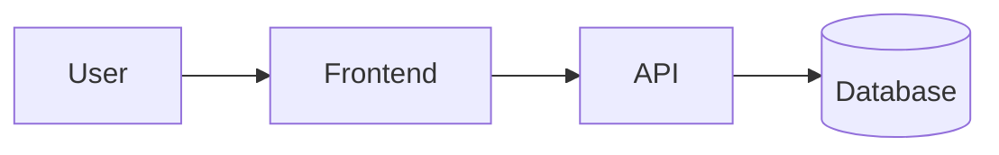

# Architecture

*Owned by the architect agent. If code and this doc disagree, fix one of them.*

## Stack
<!-- Filled during /kickoff: language, framework, database, auth, hosting. -->

## System diagram

<!-- Replace with the real shape during /kickoff. -->

## Data model
<!-- Core entities and relationships. Keep at the conceptual level; the schema lives in migrations. -->

## Key flows
<!-- The 1-3 flows that matter: e.g. signup, the core loop, payment. Bullet steps, not prose. -->

## AWS footprint
<!-- Every AWS resource this project uses, why, and estimated monthly cost. -->

| Resource | Purpose | Est. cost/month |
|---|---|---|
| | | |

## Environments
- **prod** — the only environment until the PRD demands more. Deployed from `main` via `.github/workflows/deploy.yml`.
